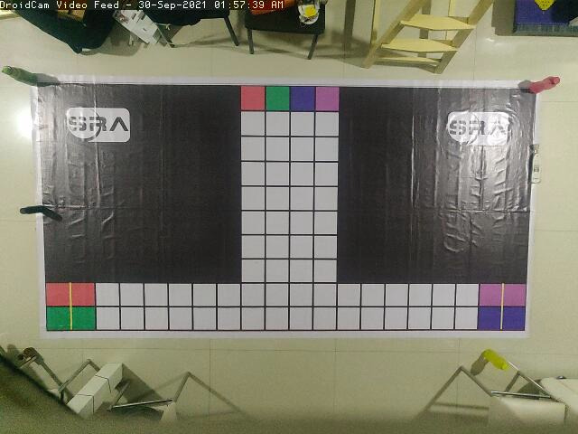
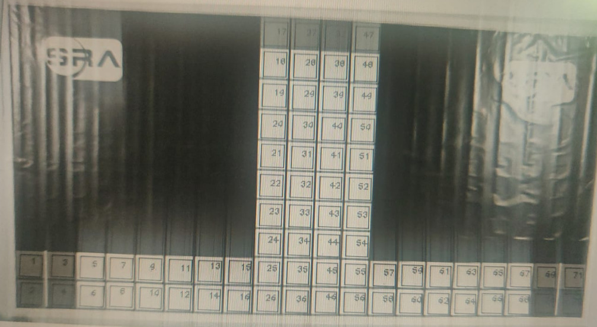
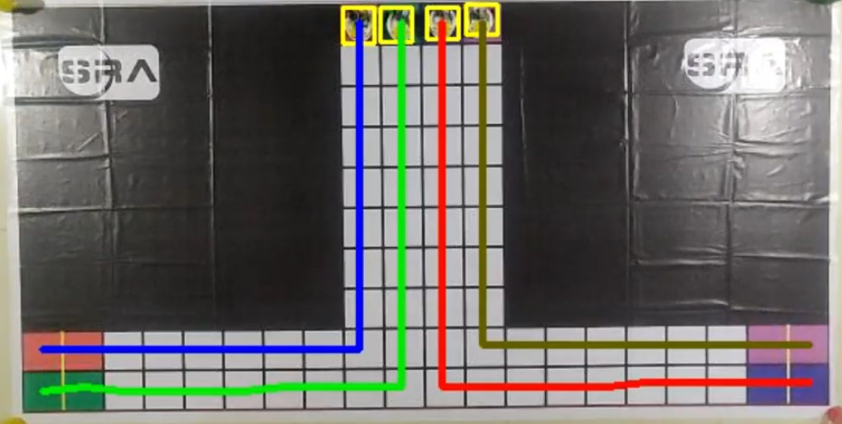

# COMPUTER VISION NOTES - TASK 1

## 1. Grid Detection

Detect the grid cells in the given input image using traditional image processing techniques. Test the algorithm on various [test images](../assets/task1/).   

- Input

- Output

## 2. Path Planning

Perform path planning as show below where each color denotes different paths. Use same test images mention above.
- Output
